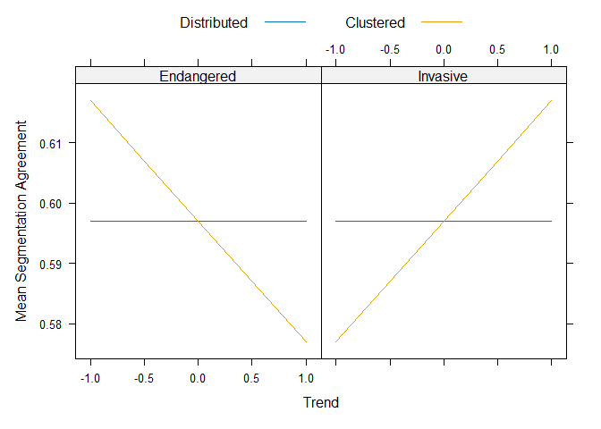

Data simulation and example analysis for *Event Segmentation with
Dynamic Maps: Influence of Framing and Spatial Pattern of Change*
================
2024-09-03

``` r
set.seed(1331)

library(dplyr)
library(lme4)
```

# Description

This is a simulated data set with accompanying data analysis which was
used as basis for a power simulation for an experiment at the
Leibniz-Institut für Wissensmedien (IWM).

The experiment studies segmentation behavior with dynamic maps depicting
the development of insect populations on fictional islands.
Specifically, how the framing of the insect species as invasive or
endangered, the trend of the shown population development and the
spatial pattern of the temporal change impact segmentation agreement is
investigated.

## Dependent variable

Participants are tasked to view animated maps and press the space bar
key whenever they perceive that a meaningful unit has ended and a new
one has begun. Therefore, the dependent variable is the timing of these
key presses in milliseconds relative to the stimulus onset. From there,
we calculate segmentation agreement as follows:

1.  For each stimulus and participant, convert the timing of key presses
    into 30 1-second bins of 0s and 1s, indicating whether the
    participant has pressed the key during that second

2.  Calculate the group norm for that stimulus by calculating the
    proportion of all other participants that have pressed the key in
    each 1-second bin

3.  Calculate the correlation of the participant’s binned time series
    with the group norm

4.  Scale the correlation using the minimal and maximal possible
    correlation given the number of segmentation responses

## Conditions

The experiment will be a within-subject design, so all participants will
be in all conditions. Three variables are systematically and
orthogonally varied across the stimuli set each participant gets to see:

1.  Trend (metric): -1, -0.5, 0.5, 1 (only applied to the regions of the
    map selected to change)

2.  Framing: Invasive vs. Endangered

3.  Spatial Pattern: Clustered vs. Distributed

# Hypothesis

This study aims to investigate whether segmentation agreement increases
when the regions of the maps that depict change over time are clustered
together rather then spread out across the map.

Based on the results of a previous study, we expect the marginal effect
of trend on segmentation agreement to be negative if the species is
framed as endangered and positive if it is framed as invasive. We
further expect this difference to be more pronounced for maps in which
the changing regions are clustered together than for those in which they
are spread out.

``` r
design <- expand.grid(
  trend       = c(-1, -0.5, 0.5, 1),
  framing     = c(-1, 1),  # 1 = Invasive, -1 = Endangered
  spatialdist = c(0, 1)    # 0 = Distributed, 1 = Clustered,
)

# Intercept
f_intercept <- 0.597

# Main effects
f_trend        <- 0.0
f_spatialdist <- 0.0
f_framing      <- 0.0

# Interactions
f_trend_spatialdist         <- 0.0
f_trend_framing             <- 0.0
f_framing_spatials_dist     <- 0.0
f_trend_spatialdist_framing <- 0.02

design$seg_agree <-
  f_intercept +
  f_trend * design$trend +
  f_spatialdist * design$spatialdist +
  f_framing * design$framing +
  f_trend_spatialdist * design$trend*design$spatialdist +
  f_trend_framing * design$trend * design$framing +
  f_trend_spatialdist_framing * design$trend * design$spatialdist * design$framing

design$framing <- factor(design$framing,
                         levels = c(-1, 1),
                         labels = c("Endangered", "Invasive"))

design$spatialdist <- factor(design$spatialdist,
                             levels = c(0, 1),
                             labels = c("Distributed", "Clustered"))

# Hypothesis plot
lattice::xyplot(seg_agree ~ trend | framing,
                design,
                groups = spatialdist,
                type = "l",
                xlab = "Trend",
                ylab = "Mean Segmentation Agreement",
                auto.key = list(space = "top", column = 2))
```



# Data simulation

``` r
# Random effect subjects
subject_sd             <- 0.1
subject_trend_sd       <- 0.03
subject_framing_sd     <- 0.01
subject_spatialdist_sd <- 0.01
residual_sd            <- 0.2

n <- 175

dat <- expand.grid(
  subj_id     = c(paste("subj", stringr::str_pad(1:n, 2, "left",0), sep = "_")),
  trend       = c(-1, -0.5, 0.5, 1  ),
  framing     = c(-1, 1),  # 1 = Invasive, -1 = Endangered
  spatialdist = c(0, 1)    # 0 = Distributed, 1 = Clustered,
)
 
subject_intercepts <- data.frame(
  subj_id     = c(paste("subj", stringr::str_pad(1:n, 2, "left",0), sep = "_")),
  subj_interc = rnorm(n, mean = 0, sd = subject_sd)
)
subject_slope_trend <- data.frame(
  subj_id     = c(paste("subj", stringr::str_pad(1:n, 2, "left",0), sep = "_")),
  subj_interc = rnorm(n, mean = 0, sd = subject_trend_sd)
)
subject_slope_framing <- data.frame(
  subj_id     = c(paste("subj", stringr::str_pad(1:n, 2, "left",0), sep = "_")),
  subj_interc = rnorm(n, mean = 0, sd = subject_framing_sd)
)
subject_slope_spatialdist <- data.frame(
  subj_id     = c(paste("subj", stringr::str_pad(1:n, 2, "left",0), sep = "_")),
  subj_interc = rnorm(n, mean = 0, sd = subject_spatialdist_sd)
)

dat <- dat |>
  group_by(subj_id) |>
  mutate("resp" := f_intercept +
                   # main effects
                   f_trend*trend +
                   f_spatialdist * spatialdist +
                   f_framing*framing +
                   # interactions
                   f_trend_spatialdist * trend * spatialdist +
                   f_trend_framing * trend * framing +
                   f_framing_spatials_dist * framing * spatialdist +
                   f_trend_spatialdist_framing * trend * spatialdist * framing +

                   # random effects
                   subject_intercepts[cur_group_id(), "subj_interc"] +
                   subject_slope_trend[cur_group_id(), "subj_interc"] * trend +
                   subject_slope_framing[cur_group_id(), "subj_interc"] * framing +
                   subject_slope_spatialdist[cur_group_id(), "subj_interc"] * spatialdist +
                   rnorm(n(), mean = 0, sd = residual_sd)) |>
  ungroup()
```

# Descriptives

``` r
str(dat)
```

    ## tibble [2,800 × 5] (S3: tbl_df/tbl/data.frame)
    ##  $ subj_id    : Factor w/ 175 levels "subj_01","subj_02",..: 1 2 3 4 5 6 7 8 9 10 ...
    ##  $ trend      : num [1:2800] -1 -1 -1 -1 -1 -1 -1 -1 -1 -1 ...
    ##  $ framing    : num [1:2800] -1 -1 -1 -1 -1 -1 -1 -1 -1 -1 ...
    ##  $ spatialdist: num [1:2800] 0 0 0 0 0 0 0 0 0 0 ...
    ##  $ resp       : num [1:2800] 0.644 1.016 0.714 0.402 1.002 ...

``` r
summary(dat)
```

    ##     subj_id         trend           framing    spatialdist       resp        
    ##  subj_01:  16   Min.   :-1.000   Min.   :-1   Min.   :0.0   Min.   :-0.1482  
    ##  subj_02:  16   1st Qu.:-0.625   1st Qu.:-1   1st Qu.:0.0   1st Qu.: 0.4541  
    ##  subj_03:  16   Median : 0.000   Median : 0   Median :0.5   Median : 0.6040  
    ##  subj_04:  16   Mean   : 0.000   Mean   : 0   Mean   :0.5   Mean   : 0.6009  
    ##  subj_05:  16   3rd Qu.: 0.625   3rd Qu.: 1   3rd Qu.:1.0   3rd Qu.: 0.7494  
    ##  subj_06:  16   Max.   : 1.000   Max.   : 1   Max.   :1.0   Max.   : 1.3184  
    ##  (Other):2704

``` r
# Aggregate data for plot
datm <- dat |>
  group_by(framing,  trend, spatialdist) |>
  summarize(mean_agreement = mean(resp))
```

    ## `summarise()` has grouped output by 'framing', 'trend'. You can override using the `.groups` argument.

``` r
datm$framing <- factor(datm$framing,
                       levels = c(-1, 1),
                       labels = c("Endangered", "Invasive"))

datm$spatialdist <- factor(datm$spatialdist,
                           levels = c(0, 1),
                           labels = c("Distributed", "Clustered"))

lattice::xyplot(mean_agreement ~ trend | framing,
                datm,
                groups = spatialdist,
                type = c("p", "r"),
                xlab = "Trend",
                ylab = "Mean Segmentation Agreement",
                auto.key = list(space = "top", column = 2))
```

<!-- -->

# Analyses

``` r
m1 <- lmer(resp ~ framing * trend * spatialdist + (trend + framing + spatialdist | subj_id),
           data = dat)
```

    ## Warning in checkConv(attr(opt, "derivs"), opt$par, ctrl = control$checkConv, : Model failed to converge with
    ## max|grad| = 0.00270083 (tol = 0.002, component 1)

``` r
summary(m1)
```

    ## Linear mixed model fit by REML ['lmerMod']
    ## Formula: resp ~ framing * trend * spatialdist + (trend + framing + spatialdist |      subj_id)
    ##    Data: dat
    ## 
    ## REML criterion at convergence: -725.9
    ## 
    ## Scaled residuals: 
    ##     Min      1Q  Median      3Q     Max 
    ## -3.2774 -0.6346 -0.0069  0.6592  3.1592 
    ## 
    ## Random effects:
    ##  Groups   Name        Variance  Std.Dev. Corr             
    ##  subj_id  (Intercept) 0.0086193 0.09284                   
    ##           trend       0.0006039 0.02457   0.36            
    ##           framing     0.0003095 0.01759  -0.03  0.41      
    ##           spatialdist 0.0003447 0.01857   0.09 -0.05  0.84
    ##  Residual             0.0395566 0.19889                   
    ## Number of obs: 2800, groups:  subj_id, 175
    ## 
    ## Fixed effects:
    ##                            Estimate Std. Error t value
    ## (Intercept)                0.597229   0.008804  67.837
    ## framing                    0.008290   0.005479   1.513
    ## trend                     -0.002465   0.006976  -0.353
    ## spatialdist                0.007389   0.007647   0.966
    ## framing:trend             -0.003505   0.006724  -0.521
    ## framing:spatialdist       -0.002775   0.007517  -0.369
    ## trend:spatialdist          0.004148   0.009509   0.436
    ## framing:trend:spatialdist  0.024908   0.009509   2.620
    ## 
    ## Correlation of Fixed Effects:
    ##             (Intr) framng trend  sptlds frmng:t frmng:s trnd:s
    ## framing     -0.006                                            
    ## trend        0.076  0.027                                     
    ## spatialdist -0.407  0.038 -0.002                              
    ## framng:trnd  0.000  0.000  0.000  0.000                       
    ## frmng:sptld  0.000 -0.686  0.000  0.000  0.000                
    ## trnd:sptlds  0.000  0.000 -0.682  0.000  0.000   0.000        
    ## frmng:trnd:  0.000  0.000  0.000  0.000 -0.707   0.000   0.000
    ## optimizer (nloptwrap) convergence code: 0 (OK)
    ## Model failed to converge with max|grad| = 0.00270083 (tol = 0.002, component 1)
